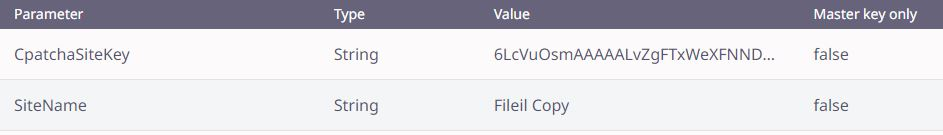

# InstanTransfer Project

In this project, a file upload and download infrastructure has been prepared to quickly share rememberable file links over the web. Demo site: [Fileil.com](https://fileil.com)

[React](https://github.com/facebook/react) was used for the Front-End and [Parse Server](https://github.com/parse-community/parse-server/) was used for the Back-End.

## Requirements

Use the package manager [npm](https://www.npmjs.com/package/npm)

[Node.js v18.x](https://nodejs.org/en/download)

[MongoDB 5 or 6](https://www.mongodb.com/try/download/community)

[Google Recaptcha v2](https://www.google.com/recaptcha/about/)

## Installation
**Note:** Parse server on nodejs may not work properly in windows environment. We recommend you to use Linux environment.

Create an .env file in the **main** folder. Add below code and edit the parameters in a necessary way.

```bash
#.env file
REACT_APP_WEBSITE_NAME = 'Site Name'
REACT_APP_DESCRIPTON_CONTENT = 'Site Meta Description'


#PARSE SERVER
REACT_APP_PARSE_CONFIG_SERVER_URL = 'http://localhost:1337/parse'
REACT_APP_PARSE_CONFIG_APP_ID = '123456'
REACT_APP_PARSE_CONFIG_JAVASCRIPT_KEY = '123456'
```

Create an .env file in the **parse-server-node-js** folder. Add below code and edit the parameters in a necessary way.

```bash
#.env file
#GENERAL OPTIONS
MONGODB_URI = 'mongodb://localhost:27017/dev'
APP_ID = '123456'
APP_NAME = 'Your App Name'
MASTER_KEY = '123456'
JAVASCRIPT_KEY = '123456'
SERVER_URL = 'http://localhost:1337/parse'
PUBLIC_SERVER_URL = 'http://localhost:1337/parse'

#YOUR DOMAİN OF CLİENT SİDE URL FOR EMAİL HTML CONTENT
CLIENT_URL = 'http://localhost'

#SMTP
SMTP_HOST = 'smtp.youremail.com'
SMTP_USERNAME = 'youremail@youremail.com'
SMTP_PASSWORD = 'yoursmtppassword'
SMTP_FROM_ADRESS = 'youremail@youremail.com'
SMTP_CONTACT_US_PAGE_TO = 'youremail@youremail.com'
SMTP_PORT = 587

#CAPTCHA
CPATCHA_SECRET = 'YourGoogleReCaptchaSecretKey'

#PARSE DASHBOARD LOGIN INFO
PARSEDASHBOARD_USERNAME = 'username'
PARSEDASHBOARD_PASSWORD = 'password'
```

Go to the **parse-server-node-js** folder

```bash
npm install
npm run start
```

Go to [http://localhost:1337/dashboard](http://localhost:1337/dashboard)

Login the panel and go to **Dashboard > Config**

Add parameters like below;



**CpatchaSiteKey** : Your Google Recaptcha Site key

**SiteName** : Your Site Name

Go to **main** folder

```bash
npm install
npm run start
```

New version of parse server disabled except some extensions all file extensions to upload. You can fix this situation comment the code like below.

Go to **parse-server-node-js>node_modules>parse-server>lib>Routers>FilesRouter.js**

**Comment** line 147 to 150 like below;

```javascript
// if (!isValidExtension(extension)) {
//   next(new _node.default.Error(_node.default.Error.FILE_SAVE_ERROR, `File upload of extension ${extension} is disabled.`));
//   return;
// }
```

## Usage

Go to **parse-server-node-js** folder and start the Parse Server

```bash
npm run start
```

Go to **main** folder and start the React Front-End

```bash
npm run start
```

## Configuration

On forgot your password page entering wrong email normally does not result errors. If you want to display error's, you can comment the code like below.

Go to **parse-server-node-js>node_modules>parse-server>lib>Routers>UserRouter.js**

**Comment** line 377 to 379 like below;

```javascript
// return {
//   response: {}
// };
```

## Contributing

Pull requests are welcome. For major changes, please open an issue first
to discuss what you would like to change.

## License

[MIT](https://choosealicense.com/licenses/mit/)
